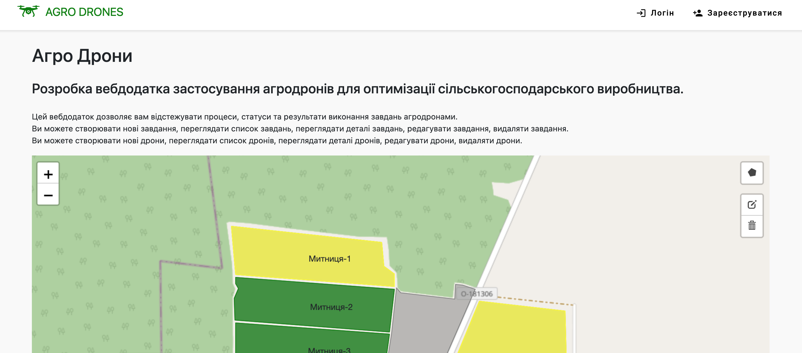
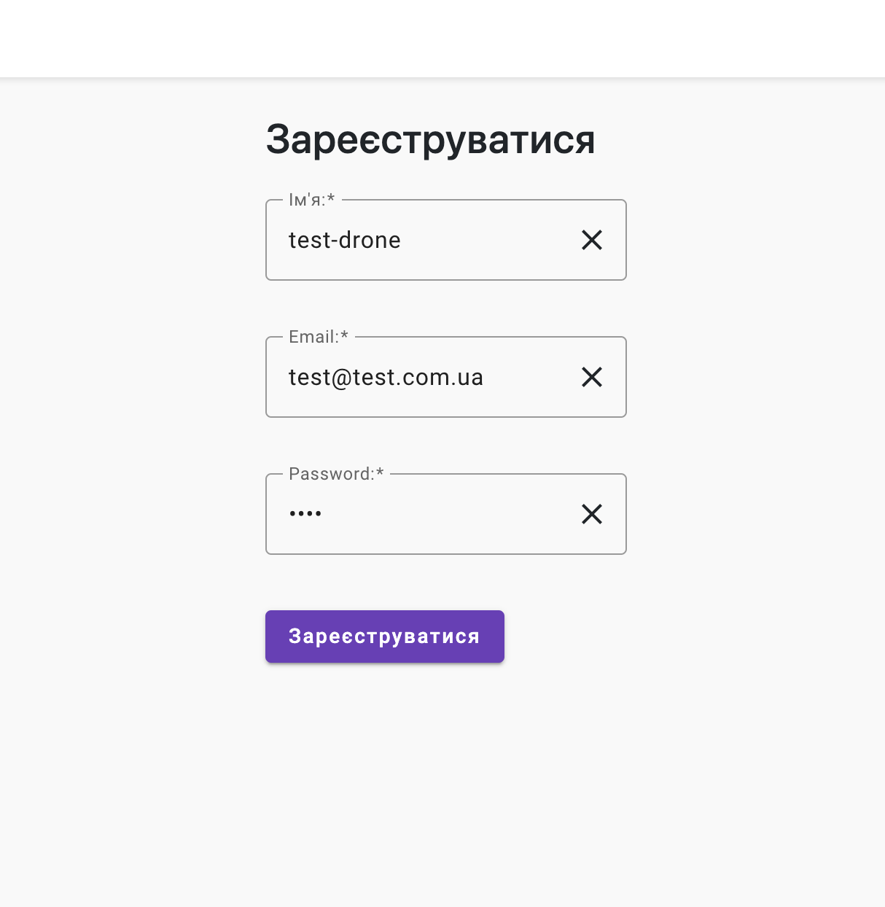
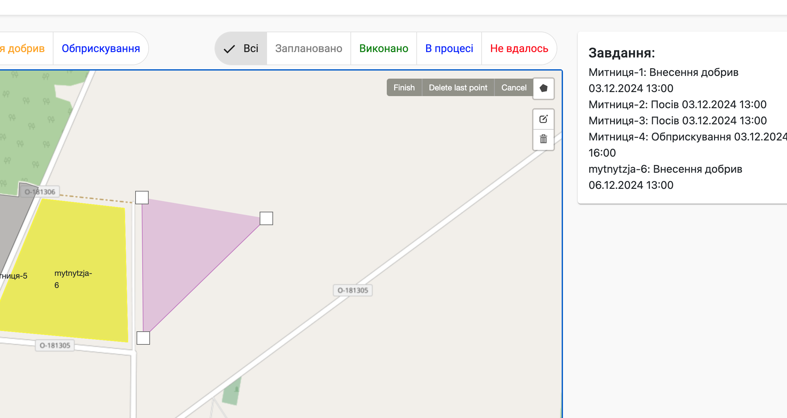
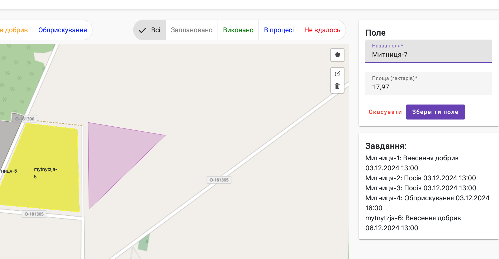
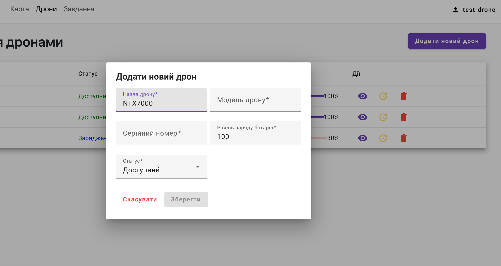
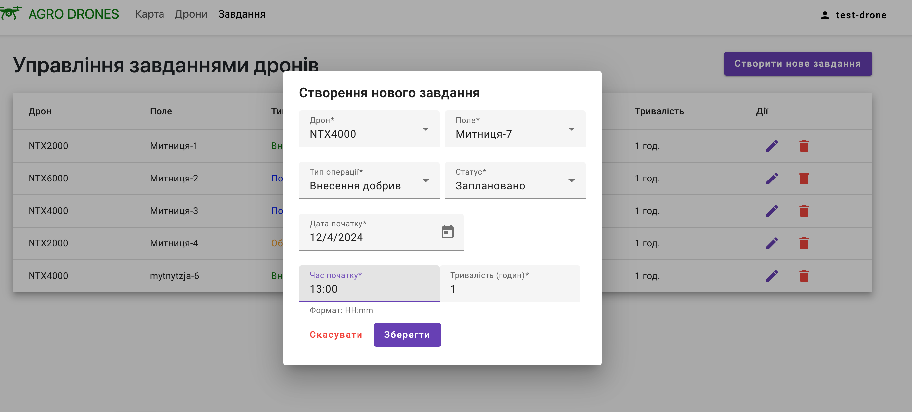
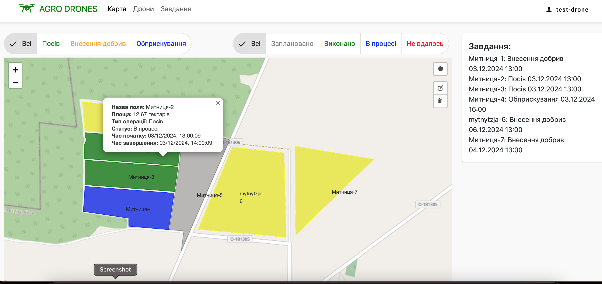
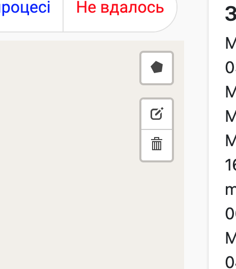

# Agro Drones Project

## Установка та залежності
- Клонувати репозиторій:
```sh
git clone https://github.com/gemenej/agro-drones.git
```

- Встановити залежності для бекенду:
```sh
cd agro-drones/backend
npm install
```

- Встановити залежності для фронтенду:
```sh
cd agro-drones/frontend
npm install
```

- Встановити mongodb, якщо він не встановлений:
-- [Windows](https://docs.mongodb.com/manual/tutorial/install-mongodb-on-windows/)
-- [Linux](https://docs.mongodb.com/manual/administration/install-on-linux/)
-- [Mac](https://docs.mongodb.com/manual/tutorial/install-mongodb-on-os-x/)

- Для зручності і візуального представлення даних можна встановити [Compass](https://www.mongodb.com/products/compass)
-- [Windows](https://docs.mongodb.com/compass/master/install/)
-- [Linux](https://docs.mongodb.com/compass/master/install/)
-- [Mac](https://docs.mongodb.com/compass/master/install/)

- Запустити mongodb:
-- [Windows](https://docs.mongodb.com/manual/tutorial/install-mongodb-on-windows/#start-mdb-edition)
-- [Linux](https://docs.mongodb.com/manual/administration/install-on-linux/)
-- [Mac](https://docs.mongodb.com/manual/tutorial/install-mongodb-on-os-x/)

- Після цього відкрити Compass і підключитися до бази даних:
-- Hostname: localhost
-- Port: 27017

- Налаштування змінних середовища бекенду:
-- Створити файл `.env` у папці `agro-drones/backend` та вказати наступні змінні середовища:
```sh
PORT=3000
MONGODB_URI=mongodb://localhost:27017/agro-drones-db
JWT_SECRET=somesupersecretsecret
REFRESH_TOKEN=somesupersecretrefresh
PERIOD_MIN=60
```

## Запуск та інтерфейс

- Запуск бекенду:
```sh
cd agro-drones/backend
npm run dev
```

- Запуск фронтенду:
```sh
cd agro-drones frontend
ng serve
# or
npm start
```

- Перейти за посиланням [http://localhost:4200/](http://localhost:4200/)

- Відобразиться таке вікно:

[](./images/home.png)

- Для входу в систему потрібно зареєструватися або увійти:
-- Для реєстрації потрібно вказати ім'я, email та пароль:
[](./images/register.png)

- Для створення поля (виділеного на карті) потрібно перейти на вкладку `Карта`. Після цього вибрати зону на карті використовуючи інструмент `Draw Polygon`, створити координати та натиснути кнопку `Save`:
[](./images/create-field.png)

- Після створення поля на карті, з'явиться форма для введення даних про поле, де можна вказати назву поля, та площу поля(вираховується автоматично):
[](./images/field-form.png)

- Для створення дрона потрібно перейти на вкладку `Дрони` та натиснути кнопку `Додати новий дрон`:
[](./images/create-drone.png)

- Після створення дрона можна перейти до створення завдання для дрона:
-- Перейти на вкладку `Завдання` та натиснути кнопку `Додати нове завдання`:
[](./images/create-task.png)

- Після створення завдань можна перейти до вкладки `Карта`, де відобразяится поля та завдання на карті:
[](./images/interactive-map.png)

- При натисканні на поле відкриється вікно з детальною інформацією про поле або завдання, якщо призначене для поля.

- Також є можливість редагувати полів, а також видаляти їх, користуючись відповідними кнопками.
[](./images/field-details.png)

- Над картою є можливість фільтрувати поля та завдання за статусом.

- Для виходу з системи потрібно натиснути на іконку користувача в правому верхньому куті та натиснути кнопку `Вийти`.

## Технології
- Angular
- Node.js
- Express.js
- MongoDB
- JWT
- Leaflet
- Bootstrap
- Material Design
